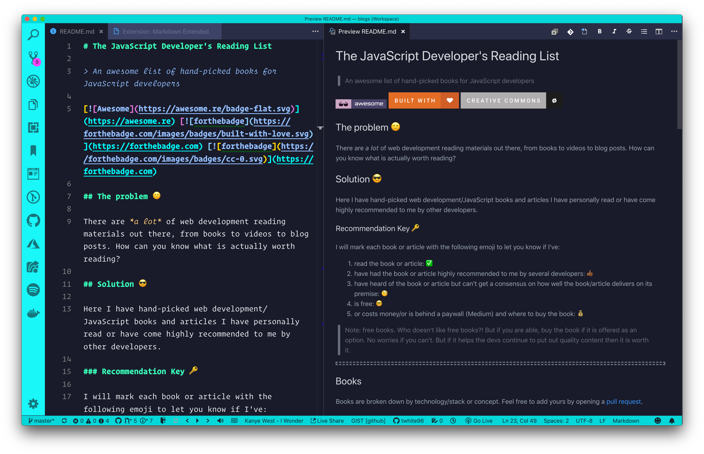
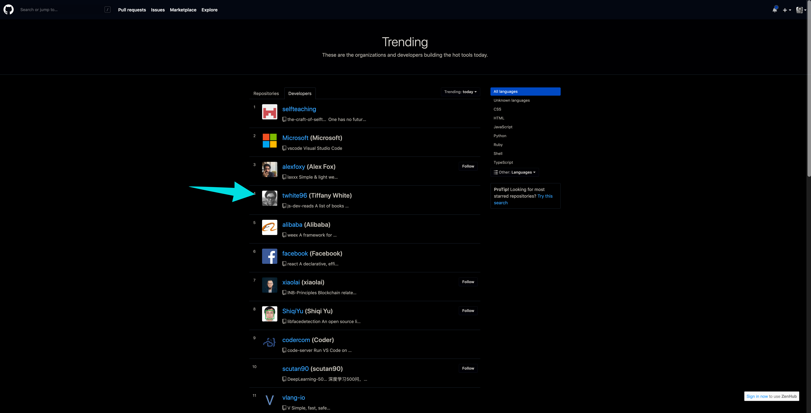

I spent the better part of last week working on a project I started almost two years ago.

The premise? Create a repository of books for web developers to read and open source it to GitHub.

I created the repo then and made it private; I didn't have time to put in the work required to make it serviceable let alone *great*.

I watched as repos with resources being shared for developers became increasingly popular. I decided to try my hand at my reading list and another repo I have going. I spent *12 hours over three days* creating the repo, gathering books I had read or that were recommended to me; articles I found that had an effect on the way I think about web development and those that were recommended to me.

## Awesome list or not to Awesome list

Originally it was made to be an [Awesome list](https://github.com/sindresorhus/awesome). I was chasing that clout, of course; getting my repo in front of thousands of eyes was appealing. But as I worked on it I felt that the requirements left me very little freedom to make the list my own. So I scrapped it.

## Awesome did give me something though

It taught me about having a header image for your repo. It taught me about having a Code of Conduct and Contributing guidelines and Table of Contents. I worked on that for *days*.

*The first iteration in VS Code*

## Tweeting, DEV'ing and hoping for the best

I finished the repo last Friday evening. I tweeted about it:

https://twitter.com/tiffanywhitedev/status/1106678222463340550

Hashtagging made all the difference. I specifically targeted the most frequently used hashtags, throwing up a lob and hoping someone would come down for the dunk.

I also made a post on [DEV](https://dev.to/twhite/the-javascript-developers-reading-list-3fmp) talking about it.

## 2 stars become 40

I looked shortly after I made the repo public. I had two stars. By night's end I had 40.

*Not bad, not bad*

I woke up and there were *235*. I went out with my friends to celebrate one of their birthdays and while out I checked again. *394 stars*.

I also gained another 22 followers on GitHub.

## The stars kept coming

Four days on and I have *over 1300 stars*.

I also made GitHub trending:

*Number 3 is not too shabby*

*I was a "popular" developer for one day*

## How did this happen?

I attribute this to a couple of factors.

1. Riding a wave
2. A README with personality
3. Clear CoC and contribution guidelines
4. Luck
5. And good old marketing

### Riding a wave

List repos are *hot* and I don't see that slowing down any time soon. I simply rode a wave.

### README has personality

I wanted it to look a certain way; to be welcoming and have all the emojis I wanted without overdoing it. The header image and ToC really helped.

### Clear CoC and contributing guidelines

I won't tolerate bullsh*t. I also have a clear vision for the repo:

- Must be books or articles you've read and are good or thought-provoking, which is obviously subjective
- Or books and articles recommended to you by other developers, most importantly ones you respect.

These are simple quality control metrics and so far the PRs I've gotten respect this.

### Luck

See [Riding a wave](#Riding-a-wave).

### Good old marketing

This one is important. I made another tweet about it that made my skin crawl. I really, *really dislike selling*. But as someone on Twitter pointed out to me:

*Introverted most of the time*

*Extroverted for a paycheck*.

Indeed.

## Here's to the repo's health and popularity

I have more to add and plan on doing it every weekend.

You can find it below.

[The JavaScript Developer's Reading List](https://github.com/twhite96/js-dev-reads).

